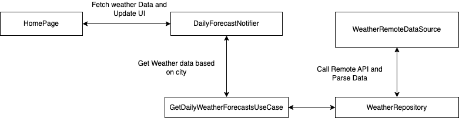

# Project Sunshine

This is a technical assessment for Flutter developer for Proshore's Flutter assignment by Suman
Adhikari.

## 1. Project Achitecture

The project is made using Clean Code Architecture. It uses Provider instead of BLoC for state management and works under feature based folder structure.

1. The `core` folder contains the `utils`, `themes` and helper feautres and functionalities used by many of the features.
2. The `features/home` folder contains all the functionality needed to make api calls, parse the jsons, maintain UI state and display to the user.

## 1.1 Project Setup
Dart: Latest
Flutter: Latest

> **Note:** API keys are already setup and a release apk is also added for testing. Default city is
> Kathmandu for now and will not be saved on change.
>
> Generated files are kept for easy build. If there are some issues, please
> run `flutter pub run build_runner build --delete-conflicting-outputs` first. 

The api base url, api keys and all are setup in `configs/app_config.json` file. And, it is setup using `lib/injections/modules/dio.dart`. `getIt` handles the DI so that object are created and pooled lazily when needed only.
 
## 1.2 General Flow

## 1.3 Features and Constraints

**Features:**

1. App supports fetching data of any city set. Defaults to Kathmandu.
2. When data is fetched at least once, the app turns to snackbar for notifying user about `loading`, `success` and `error` messages.

**Constraints:**

1. API key only supports 1000 calls per day.
2. Unit tests are not written however manually are tested.
3. City is not stored in app settings due to time constraints.
4. A detail page is not added due to time constraints.

## 1.4 Releases

To limit the need for building an app, an apk is already added in the `release ` section. You amy use that for testing as well.

## 1.5 Conclusion

This app took me 6 month to make back in 2015 when I was a beginner. I'm glad to know that I got to work on it again using Flutter in mere 2-3 days part-time. I really enjoyed the time and am happy to made the time to rework on it.

I am a BLoC focused guy for state management so it would've been easier using that. However, since Provider was requested I had to revise some and gain new perspectives on the use of adding and removing listeners, updating UI using provider listeners and many functionalities.

